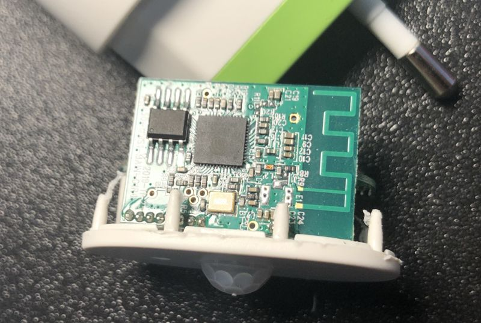
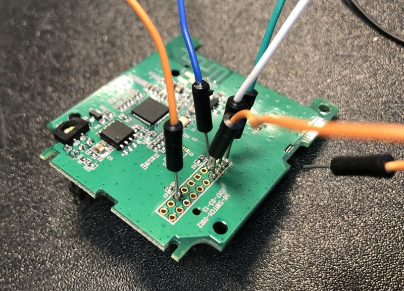

## myStrom WiFi devices
Make myStrom WiFi devices run ESPHome firmware

### Sponsoring

All my reverse engineering work is paid with my low little budget, so every donation is very welcome, either through the Patreon link on the side or through Paypal Me:

[Paypal Me](https://paypal.me/renderingfun)

### Update

#### 26.03.2021

- Added myStrom WiFi PIR sensor ESP32 board image
- Added initial YAML file
- Initial repository

### myStrom WiFi Plug

#### myStrom WiFi plug GPIO mapping

Following GPIO signals from the ESP32-W0 chip are used on myStrom Wifi 2:

    - GPIO4    Input pulses from AD71056 energy meter
    - GPIO16   Front red LED
    - GPIO17   Front white LED
    - GPIO19   I2C SCL signal for temperature sensor
    - GPIO22   I2C SDA signal for temperature sensor
    - GPIO23   Pushbutton on the side
    - GPIO27   Relay output

#### myStrom WiFi Plug board programming header

On the ESP32 board is an unpopulated 2x9 header which can be used for flashing the ESP32 via UART. You only need VCC, GND, TXD, RXD and GPIO0 as usual:

    GND  [] ()  TXD
    GND  () ()  RXD
    GND  () ()  GPIO0
    GND  () ()
    GND  () ()
    VCC  () ()
    VCC  () ()
         () ()
         () ()

#### Temperature sensor

The onboard temperature sensor repsonds to address 0x48 and has the label "LDEA" on its SOT23-5 package.
I am not really sure what device it is actually...but it reports a temperature when using the TMP102 component from ESPHome.

Normally it reports a temperature which is around 10 degress higher than the ambient temperature. Not sure what the purpose
is of this sensor really. myStrom advertises it as additional feature for monitoring room temperatures.

Still you might use it as a thermal protection as the sensor reports a much higher temperature when you switch on a load.

### myStrom WiFi PIR

#### myStrom WiFI PIR test points

Following test pads have been identified on the ESP32 main board:

    VCC
    GND
    TXD
    RXD
    GPIO0

Following pins are also exposed as test pads, so I assume those are for the PIR and ambient light sensor:

    GPIO19
    GPIO22

#### myStrom WiFI PIR GPIO mapping

