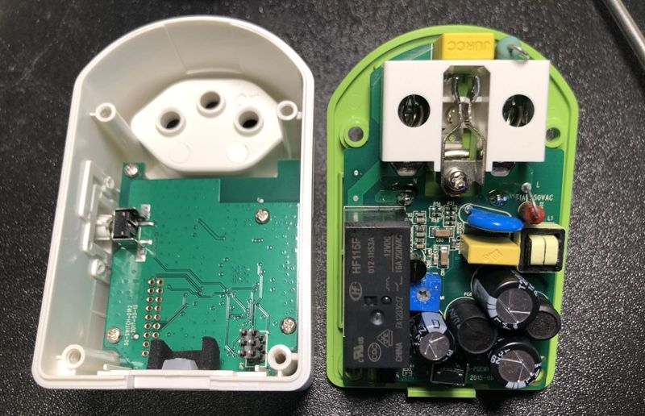

## myStrom WiFi Plug Version 2
Make the new myStrom WiFi plug run ESPHome firmware

### Sponsoring

All my reverse engineering work is paid with my low little budget, so every donation is very welcome, either through the Patreon link on the side or through Paypal Me:

[Paypal Me](https://paypal.me/renderingfun)

### Update

#### 20.03.2021

- Added initial YAML file
- Initial repository

### myStrom GPIO mapping

Following GPIO signals from the ESP32-W0 chip are used on myStrom Wifi 2:

    - GPIO4    Input pulses from AD71056 energy meter
    - GPIO16   Front red LED
    - GPIO17   Front white LED
    - GPIO19   I2C SCL signal for temperature sensor
    - GPIO22   I2C SDA signal for temperature sensor
    - GPIO23   Pushbutton on the side
    - GPIO27   Relay output

### myStrom ESP32 board programming header

On the ESP32 board is an unpopulated 2x9 header which can be used for flashing the ESP32 via UART. You only need VCC, GND, TXD, RXD and GPIO0 as usual:

    GND  [] ()  TXD
    GND  () ()  RXD
    GND  () ()  GPIO0
    GND  () ()
    GND  () ()
    VCC  () ()
    VCC  () ()
         () ()
         () ()
